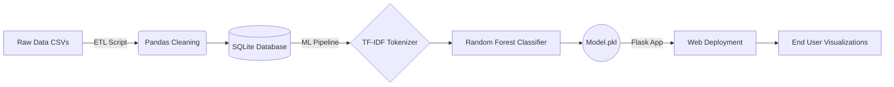

# Disaster Response Pipeline


## Executive Summary
This repository showcases an end-to-end data engineering and machine learning pipeline orchestrated to classify disaster-related messages in real-time. Designed to ingest raw streams (e.g., from social media and texts), the predictive model instantly categorizes distress signals to route them to appropriate emergency response agencies. It demonstrates robust ETL pipeline construction, high-dimensional Natural Language Processing (NLP), and the deployment of a `RandomForestClassifier` served through a scalable Flask web application.

For an extensive dive into the mathematical decisioning and architectural trade-offs behind this project, see [TECHNICAL.md](TECHNICAL.md).

## System Architecture



## Key Engineering Features
- **Deterministic ETL**: Extracts textual data, imputes missing values, engineers deterministic categorization features, and normalizes output into SQLite.
- **Robust ML Pipeline**: Implements `scikit-learn` via a customized pipeline containing an NLTK-based tokenizer, TF-IDF vectorizer, and a computationally optimized `RandomForestClassifier` wrapped within a `MultiOutputClassifier`.
- **Full-Stack Presentation**: Dynamic inference via a Python/Flask web front-end containing interactive Plotly charts tracking dataset distribution metrics.

## Quick Start 

### 1. Environment Configuration
Ensure you have an active Python virtual environment (e.g., `venv` or `conda`), and run the following commands to initialize the pipeline dependencies.

```bash
git clone https://github.com/stephengardnerd/DataEngineering_MLPipeline.git
cd DataEngineering_MLPipeline
pip install -r requirements.txt
```

### 2. Execute the ETL Process
This ingestion script merges raw disaster datasets, applies robust preprocessing schemas, and streams the output directly into a relational SQLite database.
```bash
python disaster_response_pipeline_project/data/process_data.py \
    disaster_response_pipeline_project/data/disaster_messages.csv \
    disaster_response_pipeline_project/data/disaster_categories.csv \
    disaster_response_pipeline_project/data/DisasterResponse.db
```

### 3. Compile the ML Pipeline
This command loads the normalized data, trains the Random Forest algorithm (leveraging a MultiOutput wrapper), and persists the output as a `.pkl` for dynamic inference.
```bash
python disaster_response_pipeline_project/models/train_classifier.py \
    disaster_response_pipeline_project/data/DisasterResponse.db \
    disaster_response_pipeline_project/models/classifier.pkl
```

### 4. Deploy the Front-End
Initiate the routing application to interface with the predictive model in real time.
```bash
cd disaster_response_pipeline_project/app
python run.py ../data/DisasterResponse.db ../models/classifier.pkl
```
Navigate to `http://0.0.0.0:3001/` to view the running implementation.

---
**Author:** Stephen D. Gardner
